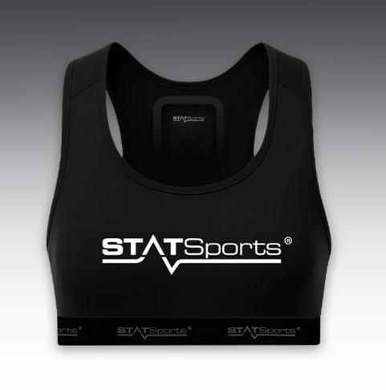
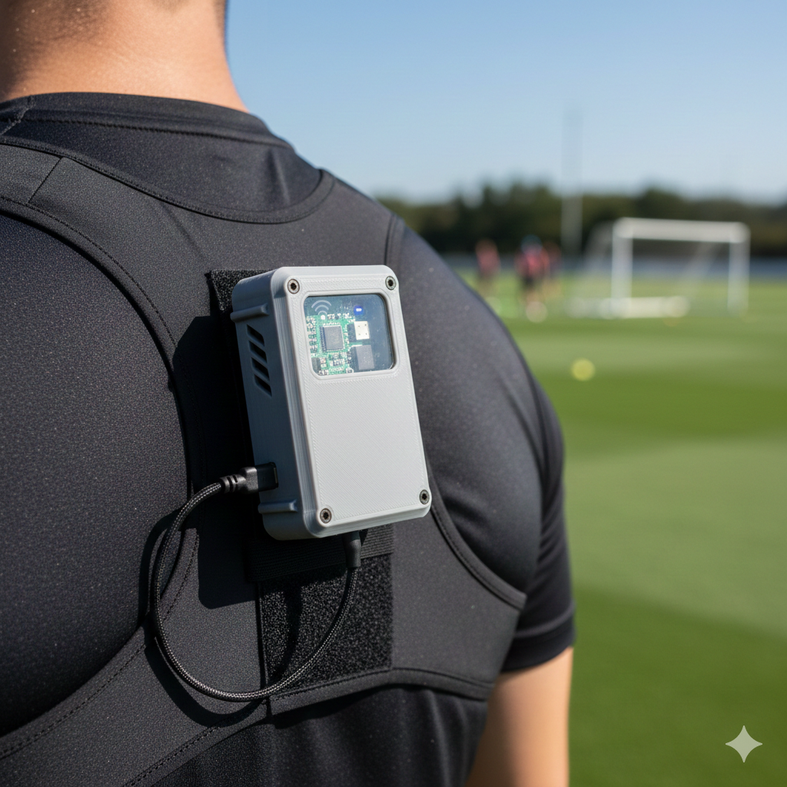
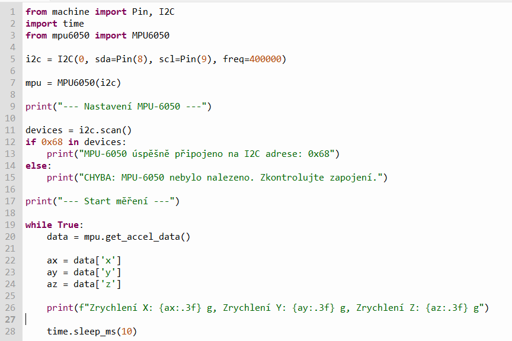

# Mikrokontrolery ve fotbale
## Cíl projektu
Cílem tohoto projektu je porovnat, jak se v profesionálním fotbale používají drahé monitorovací systémy (vesty s GPS) a jak bychom mohli podobnou funkci levně napodobit pomocí mikrokontrolerů (jako je např. Raspberry Pi Pico, Arduino, ESP32) a levných senzorů.

Zaměřím se na to, co umí drahé systémy přesně změřit (polohu, rychlost míče nebo hráče), navrhnu vlastní prototyp založený na mikrokontroleru, který nabídne cenově dostupnou alternativu a zjistím jaké problémy mohou nastávat.
## Průzkum
### Komerční systémy
Komerční sportovní analytické systémy se zaměřují na přesné a komplexní monitorování výkonu celého týmu v reálném čase.
#### Příklad: Systémy STATSports a Catapult
- Typ zařízení: Vesta/Podprsenka s malým boxem na zádech.
- Primární senzory: GNSS (GPS + GLONASS), nebo LPS (ClearSky, vlastní lokální polohový systém společnosti Catapult) pro venkovní sledování polohy. Akcelerometry, Gyroskopy a Magnetometry (IMU – Inertial Measurement Unit) pro sledování pohybu, zrychlení, zpomalení a směru.
- Sledované metriky: Rychlost (maximální, průměrná), uběhlá vzdálenost (celková, v různých rychlostních zónách), zrychlení/zpomalení (počet a intenzita), srdeční tep (pomocí externího hrudního pásu nebo integrovaného optického senzoru).
- Zpracování dat: Zařízení obsahuje výkonný mikrokontroler (často na bázi ARM Cortex architektury) a specializované čipy pro zpracování senzorických dat a fúzi senzorů. Data jsou logována do interní paměti a/nebo přenášena v reálném čase.
- Komunikace: Vysokofrekvenční rádiové přenosy (pro data v reálném čase na krátkou vzdálenost k přijímači u hřiště) nebo Bluetooth/Wi-Fi pro stažení logovaných dat po tréninku.
- Přesnost: Vysoká přesnost (poloha s přesností +- 1 metru, zrychlení s vysokou vzorkovací frekvencí až 100 Hz).
- Cena: Vysoká cena (25 000 kč+ za jednotku + licence).

### DIY projekty - jednoduché monitotování
Tyto projekty se snaží replikovat základní funkce komerčních systémů s menšími náklady.
#### Příklad: Měření metrik pomocí Raspberry Pico 2 W
Tento typ projektu je ideální pro demonstraci základních principů zpracování senzorických dat včetně bezdrátového přenosu dat v reálném čase.

- Typ zařízení: Kompaktní box mezi lopatkami (optimální místo pro GPS a stabilitu)
- Primární senzory: BNO085 (9-osý IMU): Obsahuje procesor pro „Sensor Fusion“, který automaticky kombinuje akcelerometr, gyroskop a magnetometr. u-blox NEO-M8N: GPS/GNSS modul pro přesné určení polohy.
- Sledované metriky: Skutečná rychlost (v km/h), přesná ujetá vzdálenost, heatmapy pohybu na hřišti a intenzita zrychlení bez vlivu gravitace.
- Mikrokontroler: Raspberry Pi Pico 2 W: Novější verze s vyšším výkonem (jádra ARM Cortex-M33), která zvládne paralelně zpracovávat data z GPS i IMU a zároveň je vysílat.
- Zpracování dat: Hardware Fusion: Senzor BNO085 posílá už "očištěná" data (kvaterniony), čímž se drasticky snižuje drift. GPS slouží jako absolutní reference pro opravu polohy.
- Komunikace: Bluetooth Low Energy (BLE): Pro úsporný přenos do mobilní aplikace v reálném čase. SD karta: Záložní ukládání surových dat (logování) pro pozdější hloubkovou analýzu.
- Přesnost: Komponenty jsou dražší, ale nabízejí vysokou přesnost, která se již blíží komerčním systémům jako Catapult.
- Cena: 1500 - 2500 Kč za komplet

Vygenerováno pomocí Google Gemini
#### Příklad kódu v MicroPythonu
 

S vytvořením kódu mi pomáhalo Google Gemini
#### Hlavní chyby a problémy u DIY řešení:
1. Chyby GPS (polohování)
   - Problém: Nízká přesnost a pomalá frekvence (1–5 Hz)
   - Řešení: Použijeme data z akcelerometru k "předpovídání" polohy mezi jednotlivými body z GPS. Pokud GPS pošle polohu jednou za sekundu, Pico 2 W dopočítá 50 mezibodů na základě zrychlení.
   - Další řešení: Externí anténa - Použijeme aktivní GPS antény vyvedené na horní hranu krabičky , což minimalizuje stínění tělem hráče.

2. Řešení Driftu a orientace (IMU)
   - Problém: Hromadění chyb v čase a magnetické rušení
   - Řešení: Hardwarová fůze (BNO085) - Místo počítání náklonu v MicroPythonu využijeme vestavěný procesor v BNO085 (sh-2 firmware), který v reálném čase kombinuje data z gyroskopu a magnetometru a posílá už hotové vektory (kvaterniony).
   - Řešení: Kalibrační rutina - Do programu přidáme funkci "calibrate()". Před začátkem měření musí vesta ležet 30 sekund v klidu. Systém si uloží aktuální "šum" jako nulovou hladinu a odečte ho od budoucích měření.
     
3. Řešení dynamického pohybu a vibrací
   - Problém: Falešná zrychlení způsobená otřesy při běhu
   - Řešení: Mechanické tlumení - Mezi desku s plošnými spoji a 3D tištěný obal vložíme tenkou vrstvu silikonu nebo gumy, která pohltí nejostřejší mechanické rázy.
  
4. Řešení latence a výkonu (Pico 2 W)
   - Problém: Zpoždění dat a vytížení procesoru
   - Řešení: Multicore zpracování (Využití obou jader) - Jádro 0: Bude mít na starosti pouze sběr dat a jejich ukládání
                                                       - Jádro 1: Bude provádět matematické výpočty (Kalmanův filtr) a odesílat data přes Bluetooth/Wi-Fi. Tím zajistíme, že výpočty nezpomalí zápis dat.

5. Nevhodné umístění a uchycení
   - Problém: Pokud je senzor v boxu volně, nebo je box volně uchycen na vestě, dochází k nechtěnému pohybu a vibracím.
   - Řešení: Pevné 3D tištěné pouzdro, kde je senzor pevně fixován a kde je eliminován pohyb samotného senzoru vůči tělu.

### Srovnání: Komerční vs. DIY řešení
| Aspekt | Komerční Systém (STATSports) | DIY Řešení (Pico 2 W) |
| :--- | :--- | :--- |
| **Čip/Výkon** | Optimalizované ARM Cortex-M, ASIC | RP2350 (Pico 2 W) – vysoký výkon pro náročné výpočty filtrů |
| **Senzor Polohy** | Multi-band GNSS (vysoká přesnost) | u-blox NEO-M8N (GNSS s externí aktivní anténou) |
| **Pohybový senzor** | Profesionální IMU (velmi nízký šum) | BNO085 (9-osý, integrovaná hardwarová fúze dat Bosch) |
| **Sledované metriky** | Přesná poloha (heatmapy), maximální rychlost, počet sprintů, akcelerační zátěž | Heatmapy (přes GPS), max. rychlost, detekce sprintů, zrychlení (G-force), uběhnutá vzdálenost |
| **Zpracování chyb** | Pokročilá fúze senzorů (GNSS + IMU) + proprietární Kalmanovy filtry | Hardware Sensor Fusion + doplňkový Kalmanův filtr |
| **Bezdrátová komunikace** | Vysokofrekvenční RF modul (široký dosah, spolehlivost) nebo Bluetooth LE | Wi-Fi / Bluetooth + Záložní logování na SD kartu |
| **Napájení a výdrž** | Integrovaný Li-Pol, výdrž 6–10 h, bezdrátové/rychlé nabíjení | Li-Pol (800+ mAh) + PMIC (Power Management IC), výdrž 4–6 h (dle frekvence Wi-Fi a GPS) |
| **Přesnost** | Maximální (profesionální standard) | Vysoká/Střední (plně použitelné pro sportovní analýzu) |
| **Cena HW** | 25 000 Kč+ za jednotku (+ roční licenční poplatky) | 1 500 – 2 500 Kč za komplet |
| **Cena práce (vývoj)** | Zahrnuta v ceně produktu | ~10 000 Kč+ (vyčíslení 50+ hodin odborného vývoje a ladění) |
## Zdroje
Catapult. Online. Dostupné z: https://www.catapult.com/solutions/vector-pro. [cit. 2025-12-16].

Catapult Support. Online. Dostupné z: https://support.catapultsports.com/hc/en-us/articles/360001235615-What-is-inside-Catapult-s-wearable-technology. [cit. 2025-12-16].

Alibaba. Online. Dostupné z: https://www.alibaba.com/product-insights/statsports-vest.html. [cit. 2025-12-16].

Reddit. Online. Dostupné z: https://www.reddit.com/r/diyelectronics/comments/p4sogp/diy_gps_tracker_for_footballsport_where_to_start/. [cit. 2025-12-18].

STATSports. Online. Dostupné z: https://eu.shop.statsports.com/products/statsports-academy-pro. [cit. 2025-12-18].

YouTube - Paul McWhorter. Online. Dostupné z: https://www.youtube.com/watch?v=f7Uzgt18L0M. [cit. 2025-12-18].

YouTube - Inertial Sense, Inc. Online. Dostupné z: https://www.youtube.com/watch?v=6VGl-O6MAuY. [cit. 2025-12-18].

Google Gemini. Online. Dostupné z: https://gemini.google.com/app?hl=cs. [cit. 2025-12-16].
